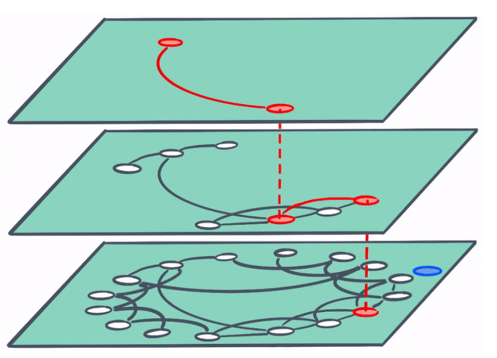

# hnsw-python

本模块为HNSW图索引
结构如下：




参考代码：
https://github.com/RyanLiGod/hnsw-python

一般的双塔模型末端采用各种pooling生成一维向量，这样会损失大量的文本信息， 其性能已经被诸多实验证明性能低于交互模型，因此检索匹配模型的研究方向考虑末端交互，也就是半交互式匹配模型，该类匹配模型在编码末端尽可能的保留编码的最大信息，主要为多个向量，而HNSW理论上是可以进行多向量的末端交互匹配的，
基于以上分析和考虑，我对参考的代码进行了修改，使其能够存储多维度的文本embedding。
#### Supported distances:

| Distance          | parameter | Equation                                                |
| ----------------- | --------- | ------------------------------------------------------- |
| Squared L2        | 'l2'      | d = sum((Ai-Bi)^2)                                      |
| Cosine similarity | 'cosine'  | d = 1.0 - sum(Ai\*Bi) / sqrt(sum(Ai\*Ai) \* sum(Bi*Bi)) |

#### examples

```python
import time
from progressbar import *
import pickle
from hnsw import HNSW

dim = 200
num_elements = 10000

data = np.array(np.float32(np.random.random((num_elements, dim))))
hnsw = HNSW('cosine', m0=16, ef=128)
widgets = ['Progress: ',Percentage(), ' ', Bar('#'),' ', Timer(), ' ', ETA()]

# show progressbar
pbar = ProgressBar(widgets=widgets, maxval=train_len).start()
for i in range(len(data)):
    hnsw.add(data[i])
    pbar.update(i + 1)
pbar.finish()

# save index
with open('glove.ind', 'wb') as f:
    picklestring = pickle.dump(hnsw, f, pickle.HIGHEST_PROTOCOL)

# load index
fr = open('glove.ind','rb')
hnsw_n = pickle.load(fr)

add_point_time = time.time()
idx = hnsw_n.search(np.float32(np.random.random((1, 200))), 10)
search_time = time.time()
print("Searchtime: %f" % (search_time - add_point_time))
```

